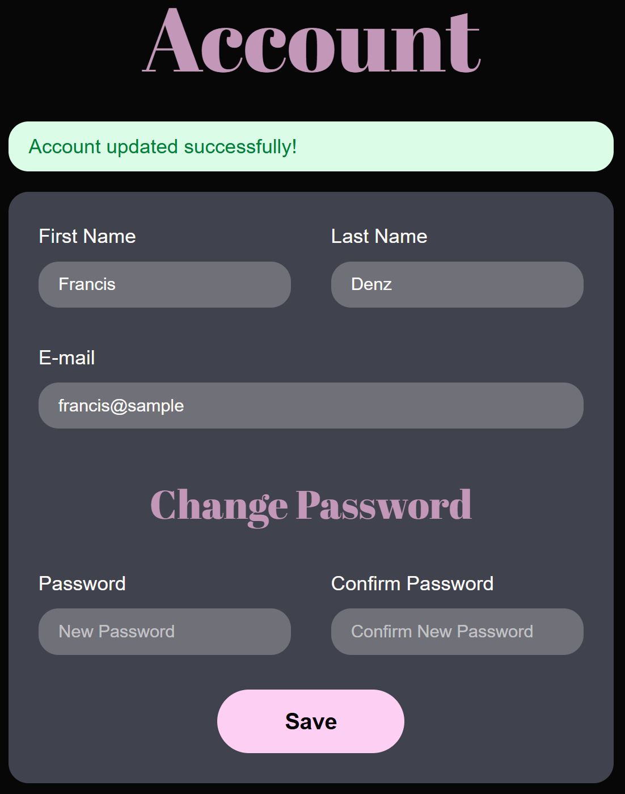

# Introduction

This is a workout tracker web application with a `React` frontend and a `Node.js/Express` backend. It enables users to explore and bookmark individual exercises. Additionally, users are able to create and manage workouts and workout plans, as well as browse and bookmark existing ones.

This document describes how accessibility was considered and integrated during development of the app.

# Team Responsibilities

- Gitte: semantic HTML, screen reader testing, contrast checker
- Franziska: semantic HTML, screen reader testing, (responsive) styling
- Elias: sematic HTML, ARIA roles, keyboard navigation

# Video Demo

[Demonstration Video](https://kaltura.hamk.fi/media/keyboard+navigation+%26+screenreader+demonstration/0_5tn2pxym)

# Implemented Accessibility Features

> **Important Information:**
> Only essential code elements related to accessibility are documented. Styling and onClick events were removed for clarity and readability.

## Features

- Zoom functionality supports up to 200%
- Text and background have sufficient constrast for readability
- Color usage is consistent for active or clickable elements
- Headings and page content consistently placed for a predictable layout
- Alternative text for images and figures is provided
- Users are informed of their current location within the app
- Feedback is provided to users (success or error messages)
- Input fields are labeled
- Navigation with keyboard and screen readers is supported

## Color Palette


The colors were checked with the color contrast checker from "WebAIM" (https://webaim.org/resources/contrastchecker/)

## Logo

The logo got the role image assigned and is described by a seperate paragraph.

```html
<div role="img" aria-describedby="logo-desc">
  <svg>svg content</svg>
  <p id="logo-desc" className="sr-only">
    Logo with a black background featuring a stylized drawing of a protein
    powder jar labeled "WHEY" in bold white letters. The jar is centered inside
    two pink concentric circles, with pink barbell icons on each side. Above the
    jar, the word "The" is written in large white letters, and below the jar,
    the words "it is" appear, forming the phrase "The whey it is."
  </p>
</div>
```


## Figure

In the dashboard a figure with the past weekly workout frequency is displayed. A role and description for screen readers were added.

```js
let chartDescription =
  'Bar chart showing how many workout sessions occurred within the past four calendar weeks per week. '

for (const week in data) {
  chartDescription += `In week ${week} the user completed ${data[week]} workouts. `
}
```

```html
<canvas
  ref="{canvasRef}"
  role="figure"
  className="bg-[#40434E] p-5 rounded-2xl"
  aria-describedby="workout-chart-desc"
></canvas>
<p id="workout-chart-desc" className="sr-only">{chartDescription}</p>
```


## Navigation (e.g. Navbar)

- Used semantic HTML like `<nav>`, `<ul>`, `<li>`.
- Provided `aria-label={"Primary navigation"}` to `<nav>` element.
- The navigation bar list item is composed of an icon and the name of the destination. The icon is `aria-hidden="true"`, because it doesn't provide added value to the screen reader.
- The active tab is announced.
- Ensured keyboard focus indicators and logical tab order.


## Tab Component

- Used `role="tablist"` and `role="tab"` appropriately
- Used `aria-selected` and `aria-controls` to indicate active tab and link cards to active tab

```js
<div role="tablist">
  <button
    id="tab-personal"
    role="tab"
    aria-selected={activeTab === tabs.personal}
    aria-controls="tabpanel-personal"
  >
    Personal
  </button>
  <button
    id="tab-bookmarks"
    role="tab"
    aria-selected={activeTab === tabs.bookmarked}
    aria-controls="tabpanel-bookmarks"
  >
    Bookmarks
  </button>
  <button
    id="tab-public"
    role="tab"
    aria-selected={activeTab === tabs.public}
    aria-controls="tabpanel-public"
  >
    Public
  </button>
</div>
```

## Cards (Plans, Workouts, Exercises)

- Provided readable and structured headings (`<h2>` for names)
- Used descriptive `aria-label` on icons like the bookmark-symbol or "more"-button
- Ensured proper focus for screen readers and tab navigation


## Forms

- Associated labels with inputs using `<label htmlFor="">` and `id`
- Added correct input `type` and `autocomplete`
- Provided meaningful error and success messages
- Ensured submit buttons are reachable and operable via keyboard

```html
<form>
  <div>
    <label htmlFor="firstName">First Name</label>
    <input
      id="firstName"
      name="firstName"
      type="text"
      placeholder="{firstName}"
      value="{firstName}"
      autocomplete="given-name"
      required
    />
  </div>
  <div>
    <label htmlFor="email">E-mail</label>
    <input
      id="email"
      name="email"
      type="email"
      placeholder="{email}"
      value="{email}"
      autocomplete="email"
      required
    />
  </div>
</form>
```




# Evaluation Tool: WAVE

Used the [WAVE – Browser Extension](https://wave.webaim.org/)

- Identified that some form inputs were missing associated `<label>` elements. Added appropriate labels to improve screen reader accessibility.
- Noticed that the `<select>` element for exercise categories lacked a label. Added a label for better accessibility and usability.
- Removed the top bar from the login and register screens to eliminate adjacent links pointing to the same destination, which helps reduce noise for screen reader users.

## Additional Improvements

- Added `autocomplete` attributes to relevant input fields (e.g., name, email, password). While this did not trigger a warning in the WAVE tool, the browser console displayed an alert indicating the absence of these attributes, so they were added to enhance the user experience.

# Screen Reader Testing: NVDA

## Challenges

- Getting used to the screen reader and how to navigate within a page with it

## Changes

- Changed `<Link>` to `<button>` so it is clearer for the user.
- Added checked and unchecked status for checkbox. Since the checkboxes were custom build, `role="checkbox"`, `aria-checked={checked}` and `tabIndex={0}` were added.
- Added aria labels to buttons.

# Conclusion

Accessibility was considered from early development. We prioritized inclusive design by implementing semantic HTML, ARIA roles and labels, screen reader support and keyboard navigation. Testing with the WAVE tool and NVDA helped us identify and fix key issues. Through this process, we learned that prioritizing accessibility from the start reduces the need for major redesings later, and create a better experience for all users.
